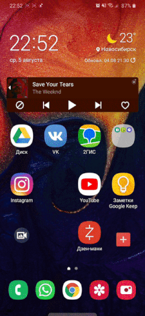

# ParserAndroidClient
Клиентская часть [OpenCartParser](https://github.com/Guha5277/OpenCartParser) выполненной на платформе Android

## Структура проекта
Проект выполнен на базе архитектуры MVP

*[Model](https://github.com/Guha5277/ParserAndroidClient/tree/master/app/src/main/java/ru/guhar4k/ilfumoclient/model)
Модуль реализующий бизнес логику. Взаимодействие с серверной частью, отправка сообщений, получения ответа и его обработка. Работа с изображениями

*[Presenter](https://github.com/Guha5277/ParserAndroidClient/tree/master/app/src/main/java/ru/guhar4k/ilfumoclient/presenter)
Получение сырых данных, их подготовка и отправка во View-компонент. Получение оповещения о событиях от View-компонента, дальнейшая передача в Model.

*[View](https://github.com/Guha5277/ParserAndroidClient/tree/master/app/src/main/java/ru/guhar4k/ilfumoclient/view) 
Модуль отвечающий за представление компонентов (работа с фрагментами и графическими элементами), имплементирована логика работы различных view-компонентов (ListView, RecyclerView).

